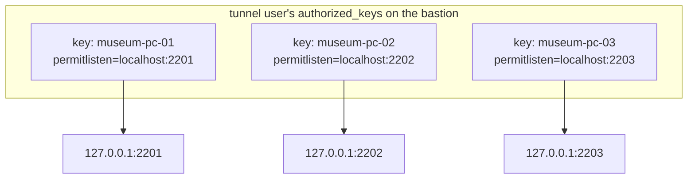
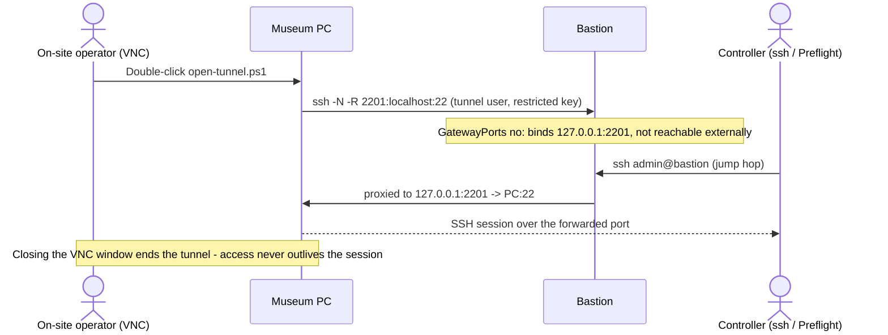

# Onboard A Target Through A Reverse-Tunnel Bastion

Use this guide once you have a hardened bastion — see
[Set up a reverse-tunnel bastion](./set-up-a-tunnel-bastion.md) — and want to
add one more machine behind it: a museum PC, kiosk, or exhibit PC on a
private network with no inbound access, reachable only via VNC or another
local console.

Each target gets its own keypair, scoped on the bastion to exactly one
loopback port, so one PC's key can never be used to reach another PC's
tunnel or open an arbitrary listener.

## Prerequisites

- A hardened bastion with an `admin` user and a `tunnel` user, per
  [Set up a reverse-tunnel bastion](./set-up-a-tunnel-bastion.md)
- Local console access to the target (VNC or similar) — the tunnel is
  started manually, never as a scheduled task or auto-start service
- A registry, even a simple spreadsheet, of PC name → assigned port → site.
  You will need to guarantee every PC gets a unique port.

## 1. Generate A Keypair On The Target

On the museum PC, in an elevated PowerShell session:

```powershell
New-Item -ItemType Directory -Path C:\ProgramData\preflight-tunnel -Force | Out-Null
ssh-keygen -t ed25519 -f C:\ProgramData\preflight-tunnel\id_ed25519 -N '' -C "museum-pc-01"
```

The private key never leaves the PC. Print the public key so you can copy
it to the bastion:

```powershell
Get-Content C:\ProgramData\preflight-tunnel\id_ed25519.pub
```

## 2. Register The Key On The Bastion, Scoped To One Port

Pick the next unused port from your registry (for example `2201`) and
record `museum-pc-01 → 2201` before you do anything else — a duplicate port
assignment will silently break either the new PC or an existing one.

On the bastion, append a restricted entry to the `tunnel` user's
`authorized_keys`:

```bash
echo 'restrict,port-forwarding,permitlisten="localhost:2201",command="/usr/sbin/nologin" ssh-ed25519 AAAA...museum-pc-01-key... museum-pc-01' \
  | sudo tee -a /home/tunnel/.ssh/authorized_keys
sudo chown tunnel:tunnel /home/tunnel/.ssh/authorized_keys
sudo chmod 600 /home/tunnel/.ssh/authorized_keys
```

What each restriction does:

| Clause | Effect |
|--------|--------|
| `restrict` | Denies everything by default (PTY, agent forwarding, X11, generic port forwarding) — every capability below has to be explicitly re-enabled |
| `port-forwarding` | Re-enables port forwarding, which `restrict` had turned off |
| `permitlisten="localhost:2201"` | Narrows that forwarding to *only* a reverse listener on `127.0.0.1:2201` — this key cannot bind any other port |
| `command="/usr/sbin/nologin"` | Even if someone used this key to open an interactive session, they'd get no shell |

This is what makes per-PC keys mutually isolated: `museum-pc-02`'s key
physically cannot open a listener on port `2201`, so it can never observe or
hijack `museum-pc-01`'s tunnel.



## 3. Add A Manual-Trigger Script On The Target

Save this as a `.ps1` on the museum PC's desktop (or wherever the on-site
operator will find it via VNC). It is deliberately **not** a scheduled task
or a service — the tunnel only exists while this window is open and someone
chose to run it.

```powershell
ssh -N -R 2201:localhost:22 tunnel@bastion.example.org `
    -i C:\ProgramData\preflight-tunnel\id_ed25519 `
    -o ServerAliveInterval=30 `
    -o ExitOnForwardFailure=yes
```

`-N` means "no remote command, just forward" and blocks for as long as the
tunnel is open; closing the window ends the session. `ExitOnForwardFailure`
makes a port conflict or a rejected key fail loudly instead of silently
running with no working forward.

> [!NOTE]
> Double-clicking a `.ps1` file often just flashes a window and closes it,
> depending on the default file association and execution policy. If that
> happens, right-click → **Run with PowerShell**, or wrap the command in a
> `.cmd` file that calls `powershell.exe -File open-tunnel.ps1` so the
> window behaves predictably for a non-technical on-site operator.

## 4. Confirm Windows' `administrators_authorized_keys` Quirk (If Applicable)

This tunnel forwards to the museum PC's own `sshd` on port 22 — so whatever
account Preflight or the operator authenticates as *through* the tunnel is
subject to normal Windows OpenSSH rules. If that account is in the local
**Administrators** group, Windows OpenSSH Server ignores the per-user
`authorized_keys` file entirely and requires
`C:\ProgramData\ssh\administrators_authorized_keys` instead, with ACLs
restricted to `Administrators` and `SYSTEM` only:

```powershell
icacls C:\ProgramData\ssh\administrators_authorized_keys /inheritance:r
icacls C:\ProgramData\ssh\administrators_authorized_keys /grant "Administrators:F" "SYSTEM:F"
```

Non-admin accounts use the normal per-user `authorized_keys` file and don't
need this. If a key that looks correctly installed still gets rejected,
check whether the target account is a local admin first.

## 5. Configure The Controller For Ad Hoc Interactive Access

For a person opening an interactive session (troubleshooting, a quick
console check), add a dedicated include file so museum-specific hosts stay
out of your main SSH config:

```text
# ~/.ssh/config
Include ~/.ssh/museum-tunnels.conf
```

```text
# ~/.ssh/museum-tunnels.conf
Host bastion
    HostName bastion.example.org
    User admin
    IdentityFile ~/.ssh/bastion_admin_key
    IdentitiesOnly yes

Host museum-pc-01
    HostName localhost
    Port 2201
    User exhibit
    ProxyJump bastion
    IdentityFile ~/.ssh/museum-pc-01_key
    IdentitiesOnly yes
```

`IdentitiesOnly yes` on **both** blocks matters: without it, SSH offers
every key it knows about at each hop, and enough wrong offers trips the
server's `MaxAuthTries` — you'll see `Too many authentication failures`
even though the *right* key is in your config. Pinning one identity per
`Host` block avoids that entirely.

`ssh museum-pc-01` now does both hops in one command: jump to `bastion`,
then connect to `localhost:2201` from the bastion's point of view, which
lands on the museum PC's forwarded `sshd`.

## 6. Point Preflight's Inventory At The Same Path

Preflight doesn't read `~/.ssh/config` `Include` files — give it the same
two-hop path natively with a `jump` block. `address` here is resolved from
the *bastion's* perspective, which is why it's `127.0.0.1`, not the
museum PC's real (unreachable) LAN address:

```yaml
inventory:
  hosts:
    - name: museum-pc-01
      address: 127.0.0.1
      port: 2201
      transport: ssh
      username: exhibit
      private_key: secret:museum-pc-01-os-key
      jump:
        address: bastion.example.org
        username: admin
        private_key: secret:bastion-admin-key
```

`private_key` on the host entry is the *museum PC's own OS-level* key for
the `exhibit` account — a different key from the `tunnel`-scoped key used
to open the tunnel itself. See
[Bastion / Jump Hosts](../explanation/targets-and-transports.md#bastion--jump-hosts)
for how Preflight's native jump support behaves.

## 7. Open A Session And Confirm It Works

On-site: VNC in and run the trigger script from step 3. From the
controller, once the tunnel is up:

```bash
ssh museum-pc-01          # ad hoc interactive check
preflight facts museum-pc-01 --output json   # proves Preflight can authenticate through both hops
```

A successful `facts` response confirms the jump host, the forwarded port,
and the target's own credentials are all correct.



## Troubleshooting

| Symptom | Likely cause |
|---------|--------------|
| `Too many authentication failures` | Missing `IdentitiesOnly yes` on one of the `Host` blocks — see [step 5](#5-configure-the-controller-for-ad-hoc-interactive-access) |
| Tunnel script exits immediately with a forwarding error | The port in `-R` doesn't match what's registered in the bastion's `authorized_keys` `permitlisten`, or another PC is already holding that port |
| Key accepted but no shell / commands silently no-op | Expected for the `tunnel` user's key — it carries `command="/usr/sbin/nologin"` by design; only use it for `-N` forwarding, never interactive login |
| Connection to the target's own `sshd` rejected despite a correct key | Check whether the target account is a local Administrator — see [step 4](#4-confirm-windows-administrators_authorized_keys-quirk-if-applicable) |
| Session dies when the on-site operator closes the VNC window | Expected — the tunnel is tied to that interactive process by design, so access doesn't outlive the person who opened it. Reopen it from the desktop script for the next session. |

## Related Docs

- [Set up a reverse-tunnel bastion](./set-up-a-tunnel-bastion.md)
- [Deploy across restricted networks](../explanation/restricted-network-deployment.md)
- [Targets, transports, and plugins](../explanation/targets-and-transports.md#bastion--jump-hosts)
- [Inventory reference](../reference/inventory.md)
- [Manage secrets](./manage-secrets.md)
