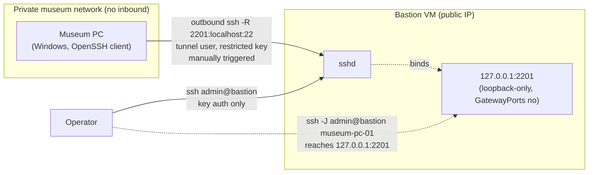

# Set Up A Reverse-Tunnel Bastion

Use this guide when a fleet of Windows machines — museum kiosks, exhibit PCs,
signage — live on a private network with no inbound access, and you've
decided (per
[Deploy across restricted networks](../explanation/restricted-network-deployment.md#use-reverse-ssh-tunnels-when-targets-can-dial-out))
that a reverse SSH tunnel through a bastion is the right pattern. It walks
through provisioning and hardening the **shared bastion VM**, once, for the
whole fleet.

This guide does not cover individual targets. Once the bastion is hardened,
add each machine with
[Onboard a target through a reverse-tunnel bastion](./onboard-a-target-through-a-bastion.md).

> [!NOTE]
> Preflight does not create, maintain, or know about this tunnel — it is
> pure operator tooling around *reaching* a target, not a Preflight feature.
> See [Targets, transports, and plugins](../explanation/targets-and-transports.md#bastion--jump-hosts)
> for how Preflight itself dials through a bastion once the tunnel exists.

## Prerequisites

- A small always-on Linux VM with a public IP. Oracle Cloud's "Always Free"
  tier (permanently free, not a trial) or a cheap Hetzner Cloud instance
  (~€3.79/mo) both work well — any Debian/Ubuntu VM you control is fine.
- Root or `sudo` access on that VM to complete initial hardening.
- No software gets installed on the museum PCs themselves beyond what
  Windows already ships (the OpenSSH client). All of the hardening in this
  guide happens on the bastion, not the targets.

The commands below assume a Debian/Ubuntu VM (`apt`, `ufw`). Adjust package
names and the firewall tool for other distributions.

## 1. Provision The VM

Spin up the VM from your chosen provider and confirm you can SSH in as the
default user. Nothing else on the VM matters yet — the next steps replace
the default access model with the two-user setup this pattern depends on.

## 2. Create Two Separate SSH Users

Split the bastion into an operator identity and a tunnel-only identity, so
one compromised museum PC key can never touch the account you use to
administer the box:

```bash
# admin: the operator, normal interactive login
sudo adduser admin
sudo usermod -aG sudo admin

# tunnel: used only by museum PCs' reverse-tunnel keys, no shell login
sudo adduser --disabled-password tunnel
```

Copy your own public key into `admin`'s `authorized_keys` before you lock
down password auth in the next step, or you will lock yourself out:

```bash
sudo mkdir -p /home/admin/.ssh
sudo tee -a /home/admin/.ssh/authorized_keys < ~/.ssh/id_ed25519.pub
sudo chown -R admin:admin /home/admin/.ssh
sudo chmod 700 /home/admin/.ssh
sudo chmod 600 /home/admin/.ssh/authorized_keys
```

The `tunnel` user gets no keys yet — those are added one at a time, one per
museum PC, with per-key restrictions. See
[Onboard a target through a reverse-tunnel bastion](./onboard-a-target-through-a-bastion.md).

## 3. Lock Down `sshd_config`

Edit `/etc/ssh/sshd_config` (or drop a file in `/etc/ssh/sshd_config.d/`)
and set:

```text
PermitRootLogin no
PasswordAuthentication no
GatewayPorts no
```

`GatewayPorts no` is the load-bearing setting here: it forces every reverse
port forward to bind to `127.0.0.1` on the bastion rather than its public
interface. A forwarded port is never reachable from the internet — only a
process already running *on* the bastion (or someone who has already
authenticated as `admin` and can proxy through it) can reach it. See
[step 6](#6-understand-what-not-internet-exposed-actually-means) for why
that property is the whole point of this design.

Restart `sshd` to apply:

```bash
sudo systemctl restart sshd
```

Before closing your current session, open a **second** terminal and confirm
you can still `ssh admin@<bastion>` — if `sshd_config` has a typo, you want
to find out while your first session is still open.

## 4. Restrict The Firewall

Deny everything inbound except SSH:

```bash
sudo ufw default deny incoming
sudo ufw default allow outgoing
sudo ufw allow 22/tcp
sudo ufw enable
```

## 5. Add Baseline Hardening

```bash
sudo apt update
sudo apt install -y fail2ban unattended-upgrades
sudo dpkg-reconfigure -plow unattended-upgrades
```

`fail2ban` bans IPs that repeatedly fail SSH auth; `unattended-upgrades`
keeps the bastion patched without a standing maintenance task. Neither is
specific to this pattern — they are what you'd want on any internet-facing
SSH box.

## 6. Understand What "Not Internet-Exposed" Actually Means

The priority for this design is that no one outside your organization can
reach a museum PC, even though each PC dials out to a public VM. That
property comes entirely from the combination of `GatewayPorts no` and
per-key `authorized_keys` restrictions (covered in the onboarding guide) —
not from the tunnel itself, which is just a normal reverse SSH forward.



Nothing on the public internet can connect to port 2201 directly — it
doesn't exist outside the bastion's loopback interface. The only path in is
through an already-authenticated `admin` session on the bastion itself.
Each museum PC's key is further restricted (next guide) so it can open
*only* its own assigned loopback port, never anyone else's.

## Hardening Checklist

- [ ] `admin` logs in with a key; `PasswordAuthentication no` is set
- [ ] `tunnel` has no password and no valid shell
- [ ] `PermitRootLogin no`
- [ ] `GatewayPorts no`
- [ ] `ufw` denies all inbound except 22
- [ ] `fail2ban` and `unattended-upgrades` are installed and running

## Troubleshooting

| Symptom | Likely cause |
|---------|--------------|
| Locked out after restarting `sshd` | `admin`'s `authorized_keys` wasn't in place before `PasswordAuthentication no` took effect — use your cloud provider's console/recovery access to fix `sshd_config` |
| `ssh: connect to host bastion port 22: Connection refused` | `ufw` is enabled but the `allow 22/tcp` rule wasn't added, or was added after `ufw enable` reset state — check `sudo ufw status` |
| A museum PC's forwarded port is reachable from outside the bastion | `GatewayPorts no` isn't actually set, or `sshd` wasn't restarted after editing `sshd_config` — check `sudo sshd -T \| grep gatewayports` |

## Related Docs

- [Onboard a target through a reverse-tunnel bastion](./onboard-a-target-through-a-bastion.md)
- [Deploy across restricted networks](../explanation/restricted-network-deployment.md)
- [Targets, transports, and plugins](../explanation/targets-and-transports.md#bastion--jump-hosts)
- [Inventory reference](../reference/inventory.md)
